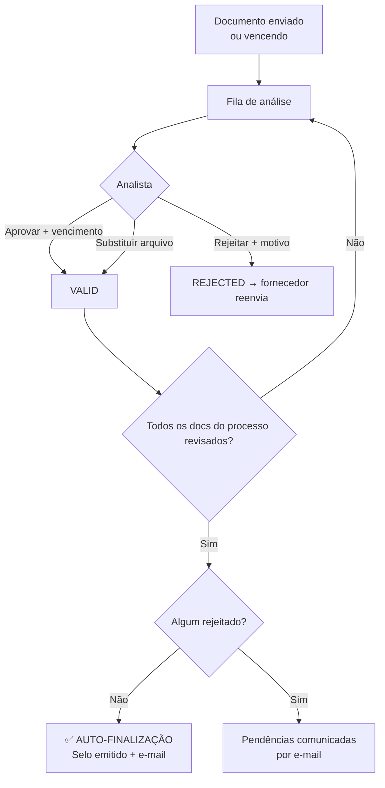

# Manual do Backoffice — SIGEC-ELOS

> Guia completo do perfil **Backoffice/Analista** (uso interno EQPI): análise documental, gestão de clientes e fluxos, portais white-label, usuários e regras operacionais.

---

## Índice "Como fazer"

| Quero... | Onde está |
|---|---|
| Analisar a fila de documentos | [Análise de Documentos](#1-análise-de-documentos) |
| Aprovar/rejeitar um documento | [Ações de análise](#11-ações-sobre-um-documento) |
| Substituir arquivo ou renovar vencimento | [Ações de análise](#11-ações-sobre-um-documento) |
| Buscar o processo de um fornecedor | [Processos](#2-processos) |
| Ver os homologados de um cliente | [Homologados](#3-homologados) |
| Criar um cliente novo | [Clientes](#5-gestão-de-clientes) |
| Montar/editar fluxos de documentos de um cliente | [Fluxos de Homologação](#6-fluxos-de-homologação) |
| Configurar o portal white-label de um cliente | [Portais White-label](#7-portais-white-label) |
| Criar usuários e perfis de acesso | [Usuários e Perfis](#8-usuários-e-perfis) |
| Cadastrar feriados (prazos do farol) | [Feriados](#4-apoio-feriados-questionários-métricas-comunicados) |

---

## 1. Análise de Documentos

A **bancada central de trabalho**: fila transversal de documentos de todos os fornecedores e clientes — o analista trabalha por documento, não por processo (mesma lógica do HOC, onde a equipe atualiza centenas de docs/dia em lote).

**Filtros:** tipo de documento, fornecedor (nome/CNPJ), status (pendente, em análise, vencido, vence hoje, próximos 5 dias, aprovado, rejeitado), vencimento até data, ordenação. Os filtros ficam salvos na sessão. Exportação CSV (página ou tudo) com **data limite de análise** calculada (SLA por tipo + rolagem para dia útil considerando feriados).

### 1.1 Ações sobre um documento

| Ação | Quando usar | Efeito |
|---|---|---|
| 👁 **Ver** | Sempre | Abre o arquivo (Storage ELOS ou S3 legado do HOC, transparente) |
| ✓ **Aprovar** | Docs pendentes/vencidos | Define **data de vencimento**; status → Aprovado |
| ✕ **Rejeitar** | Doc inválido | Motivo parametrizado (ou "Outro" com texto); fornecedor vê o motivo |
| 🔄 **Substituir** | Analista obteve a versão nova (rotina diária) | Sobe novo arquivo (≤4,5MB), define vencimento; doc fica **Aprovado** direto; versão anterior preservada no histórico |
| 📅 **Alterar vencimento** | Certidão renovada sem trocar arquivo | Data futura revalida doc vencido; retroativa vence |
| 🤖 **Extração IA** | Comprovantes bancários e DRE/balanços | Extrai dados estruturados (banco/agência/conta/PIX; receita/ativo/EBITDA) para as tabelas do fornecedor |

**Regras de fila:**

- **Auto-finalização**: quando o último documento pendente de um fornecedor é revisado, a homologação conclui sozinha (selo + e-mails), sem etapa manual extra.
- **Score por selo**: cada aprovação/rejeição recalcula o score de **cada selo** do fornecedor contra o fluxo do respectivo cliente (categorias do cliente → fluxo ativo → global).
- **Documentos desclassificatórios** vencidos/ausentes suspendem o selo automaticamente.
- Toda ação grava em `document_history` (trigger) e `audit_log` — substituições preservam a versão anterior.

## 2. Processos

Busca de processos/fornecedores (nome, CNPJ, cliente, status) e acesso à ficha completa: cadastro, sócios, documentos com histórico 🕓, sanções (inclui tipo manual "Restrição Administrativa"), selos e questionários.

## 3. Homologados

Fornecedores com selo ativo, por cliente — a "carteira viva". Use para conferências e relatórios de cadeia.

## 4. Apoio: Feriados, Questionários, Métricas, Comunicados

- **Feriados**: cadastro de feriados nacionais — os prazos (SLA de análise, farol) **rolam para o próximo dia útil**.
- **Questionários**: criação e gestão dos questionários dos clientes; avaliação de respostas.
- **Métricas**: painel de indicadores da operação.
- **Comunicados**: mensagens em massa para perfis da plataforma.

## 5. Gestão de Clientes

- **Lista de Clientes**: consulta e edição.
- **Novo Cliente**: wizard completo (dados, contrato, usuário titular). Se o CNPJ já existe (ex.: cliente migrado do HOC), o cadastro **reaproveita** o registro em vez de duplicar.
- Contas de cliente têm usuários ilimitados; contas de fornecedor, limite 4.

## 6. Fluxos de Homologação

Cada cliente pode ter **múltiplos fluxos nomeados** (ex.: VIX com 3 fluxos, um por categoria de fornecedor).

**Tela:** seletor de cliente → lista de fluxos (criar, renomear, ativar/pausar, excluir) → editor de documentos do fluxo selecionado:

- **Adicionar** documento: busca no catálogo
- Por documento: **Obrigatório** (conta no score) e **Desclassificatório** (falta/vencimento suspende o selo)
- Fluxos **inativos** saem do cálculo de score imediatamente

**Origem dos dados:** na migração do HOC, cada cliente recebeu um "Fluxo HOC (migrado)" com sua lista real de documentos. Novos fluxos podem ser criados do zero.

> Nomes de fluxo são únicos por cliente. A exclusão de um fluxo remove seus vínculos de documentos — prefira **pausar** quando houver dúvida.

## 7. Portais White-label

Página de cadastro/login personalizada por cliente:

- **Configuração**: slug (URL), logo, cores, imagem hero, textos
- URLs: `/portal/<slug>` (landing) e `/portal/<slug>/login`
- Cadastros pelo portal entram **vinculados ao cliente**; lembretes de convite apontam para o portal quando ativo
- O link aparece para o cliente nas Configurações dele

## 8. Usuários e Perfis

**Lista de Usuários**: bloquear/desbloquear, redefinir senha, editar, trocar papel.

**Novo Usuário**: cria ADMIN (analista), BUYER ou CLIENT com senha temporária enviada por e-mail.

Dois sistemas de permissão complementares:

| Sistema | Aplica-se a | O que controla |
|---|---|---|
| **Perfil de acesso** (full/analyst/readonly) | ADMIN e CLIENT | Ações sensíveis: analyst não gerencia usuários/clientes; readonly não convida/edita |
| **Perfis de módulos** | CLIENT e SUPPLIER | Quais **menus** o usuário enxerga (ex.: perfil "Documentos" só vê Documentos) |

**Perfis de Usuário (módulos):**

- Criados **somente pelo backoffice**, separados por tipo (fornecedor tem 8 módulos possíveis; cliente, 7)
- Perfil de sistema "Acesso Total" não é editável; perfis com usuários vinculados não podem ser excluídos
- Clientes e fornecedores escolhem entre os perfis existentes ao convidar suas equipes

## 9. Regras operacionais transversais

- **Banco primeiro**: as telas leem sempre do banco ELOS. Consultas externas (Receita/BrasilAPI) atualizam o banco quando trazem dado mais novo — nunca são exibidas direto sem persistir.
- **Arquivos do HOC**: documentos migrados abrem de forma transparente (S3 legado, descompressão e cache automáticos) — o analista não precisa saber a origem.
- **LGPD / contatos**: CPF de sócio é sempre mascarado nas fichas, para todos os papéis. Contatos completos: CLIENT, ADMIN e fornecedor com selo vigente; comprador sem assinatura vê mascarado (upsell). O mascaramento é server-side.
- **Convites de cliente**: lembretes automáticos ao fornecedor a cada 3 dias por até 15 dias (cron diário).
- **Enriquecimento legado**: cadastros e sócios foram enriquecidos com as bases legadas da EQPI (marca `legado_eqpi` nos registros); ~98% dos fornecedores têm e-mail e ~99% telefone.
- **Auditoria**: ações administrativas gravam em `audit_log`; documentos têm histórico completo por trigger.

---

## Perguntas frequentes

**Aprovei o último documento e o fornecedor não homologou.**
Verifique se restou algum item rejeitado (auto-finalização só aprova com zero rejeitados) e se o doc desclassificatório está válido.

**O fornecedor tem dois selos com scores diferentes. Está certo?**
Sim — cada selo é calculado contra o fluxo do seu cliente. Fluxos diferentes, denominadores diferentes.

**Substituí o arquivo errado. Como reverto?**
O arquivo anterior está no histórico do documento; substitua novamente com a versão correta. Nada é apagado.

**Posso excluir um fluxo em uso?**
A exclusão remove os vínculos de documentos do fluxo. Se o cliente tem selos calculados por ele, prefira **pausar** (inativar) — sai do cálculo sem perder a configuração.

**Cliente pediu para mudar a logo do portal.**
Portais White-label → cliente → editar logo/cores/textos → salvar. A mudança é imediata na URL pública.
