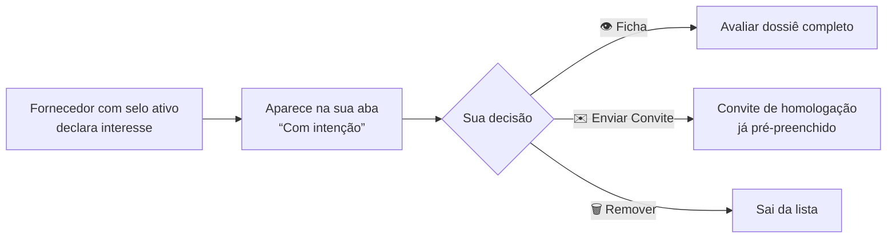
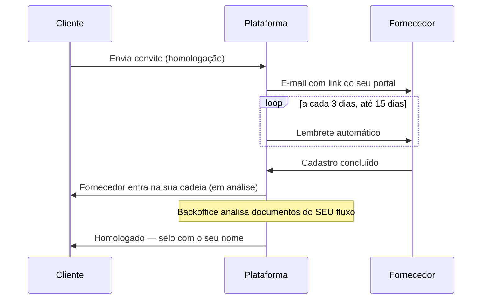

# Manual do Cliente — SIGEC-ELOS

> Guia completo do perfil **Cliente** (empresa contratante): como gerenciar sua cadeia de fornecedores homologados, convidar empresas, acompanhar processos, usar o portal com a sua marca e administrar sua equipe.

---

## Índice "Como fazer"

| Quero... | Onde está |
|---|---|
| Ver a saúde da minha cadeia de fornecedores | [Dashboard](#1-dashboard) |
| Consultar meus fornecedores homologados | [Fornecedores](#2-fornecedores) |
| Buscar fornecedores novos no mercado | [Fornecedores → aba Todos](#2-fornecedores) |
| Ver quem quer fornecer para mim | [Fornecedores com intenção](#3-fornecedores-com-intenção) |
| Convidar um fornecedor para homologação | [Convites](#4-convites) |
| Pedir cotações | [Cotações (RFQ)](#5-cotações-rfq) |
| Criar/avaliar questionários | [Questionários](#6-questionários) |
| Divulgar meu portal de cadastro personalizado | [Portal white-label](#7-configurações-e-portal-white-label) |
| Adicionar usuários da minha empresa | [Equipe](#8-equipe) |
| Entender meus fluxos de documentos | [Fluxos de homologação](#9-fluxos-de-homologação) |

---

## 1. Dashboard

Indicadores da sua cadeia:

- Total de fornecedores, homologados, em análise, suspensos
- Fornecedores **subsidiados** (você custeia a homologação)
- Saúde geral da carteira (score médio)
- Alertas: selos vencendo, documentos críticos pendentes

## 2. Fornecedores

Três abas:

| Aba | O que mostra |
|---|---|
| 🏭 **Meus Fornecedores** | Sua cadeia: status do selo, score, subsidiados; filtros por status |
| 🔍 **Todos os Fornecedores** | O **marketplace completo** — a mesma busca avançada do comprador (categoria, UF, porte, selo) para prospectar |
| 🤝 **Com intenção** | Fornecedores que declararam interesse em fornecer para você |

**Ficha do fornecedor** — como cliente, você vê **contatos abertos** (e-mail e telefone da empresa e dos sócios). CPF de sócios permanece mascarado (LGPD). A ficha traz cadastro, atividade, sócios, situação documental, categorias e sanções.

**Ações sobre um fornecedor da cadeia:** consultar processo, inativar/reativar na sua carteira, exigir questionário.

## 3. Fornecedores com intenção

Relatório do **convite reverso**: fornecedores já verificados no ELOS que declararam interesse em fornecer para sua empresa.

É um funil de entrada qualificado: essas empresas já passaram pela verificação básica da plataforma.

## 4. Convites

Para trazer fornecedores à sua cadeia:

1. **Convites → Novo convite** (ou pré-preenchido a partir da aba "Com intenção")
2. Escolha o **objetivo**:
   - 📞 **Fazer contato** — aproximação comercial
   - 🏅 **Solicitar homologação** — inicia o processo documental no seu fluxo
3. **Edite a mensagem** na tela antes de enviar
4. Para homologação, defina campos do processo (escopo, tipo de fornecedor, subsídio)

**Lembretes automáticos:** se o fornecedor não se cadastrar, a plataforma reenvia lembrete por e-mail **a cada 3 dias, por até 15 dias** — depois disso, para. O link do lembrete leva ao seu portal personalizado, quando ativo.

## 5. Cotações (RFQ)

Envie solicitações de cotação aos seus fornecedores homologados ou a fornecedores do marketplace. Acompanhe enviadas, visualizadas e respondidas.

## 6. Questionários

Instrumento de avaliação além dos documentos:

- **Criar** questionários com perguntas abertas ou objetivas
- **Aplicar** a fornecedores da cadeia (o fornecedor responde pelo menu dele)
- **Avaliar** as respostas como parte da homologação

## 7. Configurações e Portal white-label

**Dados da empresa** e preferências, e o destaque comercial:

**Portal white-label** — página de cadastro e login com a **sua marca** (logo, cores, imagem e texto próprios):

- Link do tipo `elos.eqpitech.com.br/portal/sua-empresa/login` — visível nas Configurações, pronto para copiar
- A landing page tem CTA "Quero ser Fornecedor" com campo de CNPJ: quem se cadastra por ali **já entra vinculado à sua empresa**
- Use o link em e-mails, site institucional e comunicações de suprimentos

> A configuração visual do portal (logo, cores, textos) é feita pelo backoffice — solicite ajustes ao seu contato EQPI.

## 8. Equipe

- Usuários **ilimitados** para o perfil Cliente.
- Cada usuário é vinculado a um **perfil de acesso** (conjuntos de módulos definidos pelo backoffice — ex.: "Acesso Total", "Homologação", "Consulta").
- Convide por e-mail corporativo; o usuário recebe as credenciais e já entra com o perfil atribuído.
- Você pode inativar usuários e trocar perfis a qualquer momento.

## 9. Fluxos de homologação

Cada cliente pode ter **vários fluxos nomeados** de documentos (ex.: um por categoria de fornecedor — "Fluxo Serviços Críticos", "Fluxo Materiais"):

- Cada fluxo define **quais documentos** são exigidos, quais são **obrigatórios** e quais são **desclassificatórios** (a falta suspende o selo do fornecedor)
- Fluxos podem estar **ativos ou inativos** — só os ativos contam no cálculo de score dos seus fornecedores
- A manutenção dos fluxos é feita pelo backoffice; você visualiza os seus em Configurações

**Regra de score:** o selo que você concede a um fornecedor é calculado contra o **seu** fluxo — fornecedor 100% no seu fluxo pode ter pendência no fluxo de outro cliente, e vice-versa.

---

## Perguntas frequentes

**O fornecedor diz que enviou o documento, mas o selo continua suspenso.**
Documento enviado entra "em análise" — o selo reativa quando o backoffice aprovar e não restarem itens desclassificatórios pendentes.

**Posso ter fluxos diferentes por tipo de fornecedor?**
Sim — fluxos nomeados ilimitados (ex.: 3 fluxos, um por categoria). Solicite a criação/ajuste ao backoffice.

**Quem paga a homologação?**
O fornecedor, por padrão. Você pode **subsidiar** fornecedores estratégicos — eles aparecem marcados como "Subsidiado" na sua carteira.

**Um fornecedor da lista "Com intenção" é confiável?**
Ele já tem selo ELOS ativo (verificação básica em dia). A homologação no **seu** fluxo é um crivo adicional — convide e avalie.

**Contatos na ficha aparecem mascarados para mim?**
Não — clientes veem contatos abertos. Apenas o CPF de sócios é sempre mascarado (LGPD).
