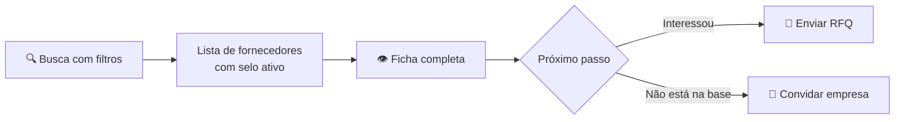

# Manual do Comprador — SIGEC-ELOS

> Guia completo do perfil **Comprador**: como buscar fornecedores verificados, consultar fichas, convidar empresas e solicitar cotações.

---

## Índice "Como fazer"

| Quero... | Onde está |
|---|---|
| Buscar fornecedores por categoria/região/selo | [Marketplace](#1-marketplace) |
| Consultar a ficha completa de um fornecedor | [Ficha do Fornecedor](#2-ficha-do-fornecedor) |
| Ver contatos completos (e-mail, telefone) | [Contatos e assinatura](#3-contatos-e-assinatura) |
| Convidar uma empresa que não está na plataforma | [Convites](#4-convites) |
| Pedir cotação a fornecedores | [Cotações (RFQ)](#5-cotações-rfq) |
| Assinar ou trocar de plano | [Meu Plano](#6-meu-plano) |

---

## 1. Marketplace

A busca central de fornecedores verificados.

**Filtros disponíveis:** texto livre (nome/CNPJ), categoria de fornecimento, tipo de selo (Verificado/Homologado), estado (UF), porte, optante do Simples, capital social.

**Regras de exibição:**

- Só aparecem fornecedores com **selo ativo** — a vitrine é de empresas em conformidade.
- O **score** (0–100) reflete a regularidade documental do fornecedor.
- Selos de homologação por cliente levam o **nome do cliente homologador** — um fornecedor "Homologado — Mineradora X" passou pelo crivo documental daquela empresa.

## 2. Ficha do Fornecedor

Dossiê completo, organizado em abas:

| Aba | Conteúdo |
|---|---|
| 📋 Cadastral | Razão social, CNPJ, endereço(s), contatos, regime tributário |
| 🏭 Atividade | CNAEs, porte, capital social, data de abertura |
| 👥 Sócios | Quadro societário com cargo, participação e telefone |
| 📄 Docs | Situação dos documentos de compliance (sem acesso aos arquivos) |
| 🏷️ Categorias | Categorias de fornecimento ativas |
| ⚠️ Sanções | Apontamentos em listas restritivas, quando existirem |

**Verificações de compliance** aparecem em selos visuais: regularidade fiscal, trabalhista, FGTS, listas restritivas.

## 3. Contatos e assinatura

A visualização de contatos depende da sua assinatura:

| Dado | Sem assinatura | Com assinatura |
|---|---|---|
| E-mail da empresa | `co*****@***.com.br` | completo |
| Telefone da empresa | `(11) *****-**17` | completo |
| Telefone dos sócios | mascarado | completo |
| CPF dos sócios | **sempre mascarado** (LGPD) | **sempre mascarado** (LGPD) |

> O mascaramento é feito no servidor — os dados completos não trafegam para o navegador de quem não tem direito.

**Fornecedores também compram:** se você é fornecedor com **selo vigente**, tem os direitos de um comprador assinante durante a vigência do selo.

## 4. Convites

Para trazer à plataforma uma empresa que ainda não está cadastrada:

1. **Convites → Novo convite** (ou direto da busca, quando o CNPJ não é encontrado)
2. Informe razão social, CNPJ e e-mail do contato
3. Escolha o **objetivo**:
   - 📞 **Fazer contato** — apresentação comercial, sem processo formal
   - 🏅 **Solicitar homologação** — convida para o processo documental completo
4. **Edite a mensagem** — o texto sugerido aparece na tela e você pode personalizá-lo antes do envio

A empresa convidada recebe o e-mail com link de cadastro. Você acompanha o status (enviado → visualizado → cadastrado) na lista de convites.

> 💡 **Preços diferenciados** estão disponíveis para compradores que subsidiam a homologação dos seus fornecedores — fale com o time comercial.

## 5. Cotações (RFQ)

Envio de solicitações de cotação a fornecedores do marketplace:

1. Na ficha do fornecedor → **Enviar RFQ** (ou pelo menu Convites/RFQ)
2. Descreva o item/serviço, quantidade e prazo
3. Acompanhe: **Enviada → Visualizada → Respondida**

**Regra:** a RFQ é dirigida a fornecedores **do marketplace** (com selo). Para empresas de fora, primeiro convide (seção anterior) — após o cadastro e verificação, elas podem receber cotações.

## 6. Meu Plano

- O plano do comprador libera a visualização de **contatos completos** e recursos de maior volume (fichas ilimitadas, RFQs ilimitadas, alertas).
- Gerencie em **Meu Plano**.

---

## Perguntas frequentes

**Por que não encontro determinada empresa na busca?**
Ou ela não está cadastrada (use Convites), ou o selo dela não está ativo — fornecedores com pendência documental saem da vitrine.

**O que significa o score?**
Percentual de documentos de compliance válidos do fornecedor. 100 = documentação em dia.

**Posso ver os documentos do fornecedor?**
Você vê a **situação** de cada documento (válido/vencendo/pendente), não os arquivos — esses pertencem ao processo de homologação do fornecedor com o respectivo cliente.

**Convidei uma empresa e nada aconteceu.**
O convite expira do funil se não houver cadastro; reenvie ou tente outro contato. Convites de clientes têm lembrete automático; convites de comprador, não.
