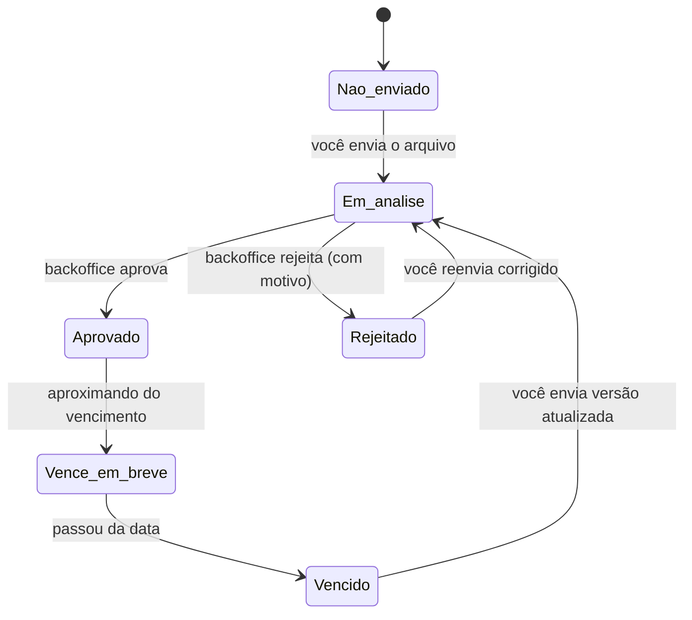
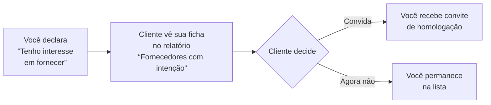

# Manual do Fornecedor — SIGEC-ELOS

> Guia completo do perfil **Fornecedor**: como se cadastrar, enviar documentos, acompanhar sua homologação, manter seu selo ativo e aproveitar os benefícios da plataforma.

---

## Índice "Como fazer"

| Quero... | Onde está |
|---|---|
| Me cadastrar na plataforma | [Cadastro](#1-cadastro) |
| Enviar ou atualizar um documento | [Documentos](#3-documentos) |
| Entender por que meu selo está suspenso | [Selo e Score](#4-selo-e-score) |
| Ver o andamento da minha homologação | [Processos](#5-processos-de-homologação) |
| Responder o questionário de um cliente | [Questionário](#6-questionário) |
| Alterar dados da empresa ou sócios | [Meus Dados](#7-meus-dados) |
| Escolher/alterar minhas categorias | [Categorias](#8-categorias) |
| Oferecer meus serviços a um cliente ELOS | [Clientes ELOS](#9-clientes-elos-convite-reverso) |
| Adicionar usuários da minha equipe | [Equipe](#10-equipe) |
| Emitir meu certificado de homologação | [Certificado](#11-certificado) |
| Trocar de plano | [Meu Plano](#12-meu-plano) |

---

## 1. Cadastro

Existem três portas de entrada:

1. **Convite de um cliente** — você recebe um e-mail com link personalizado. Clientes podem ter um **portal com a própria marca** (ex.: `elos.eqpitech.com.br/portal/nome-do-cliente`); ao se cadastrar por ele, sua empresa já fica vinculada ao processo de homologação daquele cliente.
2. **Convite de um comprador** — mesmo fluxo, iniciado por um comprador do marketplace.
3. **Cadastro espontâneo** — pelo site, informando o CNPJ.

Ao digitar o CNPJ, a plataforma consulta a Receita Federal e **pré-preenche os dados** (razão social, endereço, CNAEs). Confira e complete o que faltar.

> **Regra de negócio:** os dados exibidos nas telas vêm sempre do banco do ELOS. Consultas à Receita atualizam o cadastro quando trazem dados mais novos, mas nunca apagam o que você preencheu.

Se o fornecedor não concluir o cadastro após um convite de cliente, a plataforma envia **lembretes automáticos a cada 3 dias, por até 15 dias**.

## 2. Dashboard

Visão geral ao entrar:

- **Score geral** (0–100) e alertas de documentos pendentes ou vencendo
- **Carteira de Selos** — todos os seus selos (ELOS e por cliente), com status e score individual
- **Meus Processos** — um card por processo de homologação, com progresso de documentos
- **Documentos recentes**

## 3. Documentos

O coração da homologação. Cada documento tem um ciclo de vida:

**Tipos de documento:**

| Origem | Como funciona |
|---|---|
| ⚡ **Automático** | CNDs e certidões que a plataforma busca sozinha nos órgãos (Receita, FGTS, Trabalhista...) |
| 📎 **Manual** | Você envia o arquivo (PDF ou imagem) |

**Regras de negócio importantes:**

- A lista de documentos exigidos depende do **fluxo de homologação do cliente** (cada cliente define a sua) e das **categorias** em que você atua.
- Documentos **desclassificatórios**: se estiverem vencidos ou ausentes, **suspendem o selo** automaticamente até a regularização.
- Prazo de análise do backoffice: em média **5 dias úteis** (varia por tipo de documento; feriados nacionais prorrogam o prazo).
- Você recebe **alertas por e-mail** antes do vencimento de cada documento.
- Todo envio, aprovação e rejeição fica registrado no **histórico do documento** — nada se perde.

**Como enviar:** menu **Documentos** → localize o item → **Enviar arquivo** → aguarde a análise. Se rejeitado, o motivo aparece no próprio documento; corrija e reenvie.

## 4. Selo e Score

O selo é o resultado da homologação e o que os compradores e clientes veem no marketplace.

- **Score** = percentual de documentos exigidos que estão válidos. Cada selo tem seu próprio score, calculado contra o fluxo do respectivo cliente.
- **Selos por cliente**: quando você é homologado por um cliente (ex.: "Homologado — AngloGold"), o selo **leva o nome do cliente**.
- **Status do selo:**

| Status | Significado |
|---|---|
| 🟢 Ativo | Homologação vigente — você aparece nas buscas com destaque |
| 🟡 Em análise | Documentação em avaliação pelo backoffice |
| 🔴 Suspenso | Documento desclassificatório pendente/vencido, ou suspensão pelo cliente |
| ⚪ Expirado | Validade encerrada — renove a homologação |

> **Benefício comercial do selo vigente:** enquanto seu selo está ativo, você tem os mesmos direitos de visualização de um **comprador assinante** — vê contatos completos de outros fornecedores nas fichas do marketplace. Com o selo vencido, esses contatos voltam a aparecer mascarados até você renovar a homologação ou assinar como comprador.

## 5. Processos de Homologação

Cada cliente que exige homologação gera um **processo** com sua lista de documentos. No card do processo você acompanha:

- Score do processo e status
- Documentos: ✓ aprovados / ⏳ em análise / ✗ pendentes
- Prazo estimado da análise

Quando **todos** os documentos do processo são revisados pelo backoffice, o resultado sai automaticamente: aprovado (selo emitido, e-mail de parabéns) ou pendências comunicadas por e-mail.

## 6. Questionário

Alguns clientes exigem um questionário técnico-comercial além dos documentos.

- Acesse o menu **Questionário**, responda as perguntas e **Enviar Respostas**.
- O progresso fica salvo; você pode responder aos poucos.
- As respostas são avaliadas pelo cliente/backoffice como parte da homologação.

## 7. Meus Dados

Você mesmo mantém seu cadastro (paridade com o sistema anterior):

- **Dados cadastrais**: razão social, nome fantasia, IE/IM, endereço, telefones, e-mails (inclusive financeiro). O CNPJ não é editável.
- **Quadro societário**: adicionar, editar e remover sócios (nome, CPF, cargo, participação).
- Alterações ficam registradas em auditoria.

> **LGPD:** o CPF dos sócios **nunca** aparece completo para quem consulta sua ficha — é sempre mascarado (`***.842.318-**`).

## 8. Categorias

As categorias descrevem o que sua empresa fornece e **definem os documentos exigidos**.

- Adicione categorias pelo catálogo; remova as que não se aplicam.
- Categorias de clientes específicos são atribuídas durante a homologação daquele cliente.
- Mudar categorias pode mudar sua lista de documentos exigidos — o score é recalculado.

## 9. Clientes ELOS (convite reverso)

Vitrine das empresas que homologam fornecedores na plataforma.

- **Requisito**: ter selo ELOS **ativo**.
- Você pode declarar e retirar o interesse a qualquer momento.

## 10. Equipe

- Até **4 usuários** por fornecedor (limite do plano).
- Cada usuário é vinculado a um **perfil de acesso** que define quais módulos ele enxerga (perfis são criados pelo backoffice — ex.: "Acesso Total", "Documentos").
- O titular pode convidar, inativar e trocar o perfil dos usuários.

## 11. Certificado

Com selo **ativo**, emita o **Certificado de Homologação** (formato diploma, A4 paisagem):

- Dashboard → card do selo → **Emitir Certificado** → **Imprimir / Salvar PDF**.
- O certificado traz: razão social, CNPJ, cliente homologador, categorias, número de verificação, emissão e validade.
- Disponível **apenas** para selos ativos — selo suspenso ou vencido não emite.

## 12. Meu Plano

- Planos de fornecedor (ex.: **Verificado** e **Homologado**) com cobrança recorrente via cartão (Stripe).
- O plano define o nível do selo ELOS, a visibilidade no marketplace e recursos como documentos automáticos.
- Upgrade/downgrade pelo menu **Meu Plano**.

---

## Perguntas frequentes

**Meu selo sumiu do marketplace. Por quê?**
Selo suspenso ou expirado sai das buscas. Verifique em Documentos se há item desclassificatório vencido — regularize e o selo reativa.

**Rejeitaram meu documento, e agora?**
O motivo aparece no documento. Corrija (ex.: certidão vencida, arquivo ilegível) e reenvie — ele volta para a fila de análise.

**Posso fornecer para mais de um cliente?**
Sim. Cada cliente tem seu processo e seu selo. Os documentos comuns aproveitam o mesmo envio.

**Quem vê meus dados?**
Clientes que o homologaram veem a ficha completa (contatos abertos). Compradores sem assinatura veem contatos mascarados. CPF de sócios é sempre mascarado para todos (LGPD).
